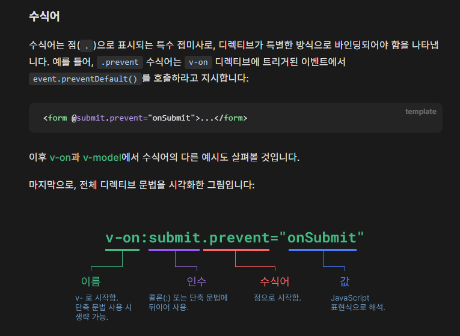

| 문법/기능           | 설명                                | 예시                                                      |
| ------------------- | ----------------------------------- | --------------------------------------------------------- |
| `ref()`             | 단일 값(문자, 숫자 등)을 반응형으로 | `const count = ref(0)`                                    |
| `reactive()`        | 객체/배열을 반응형으로              | `const user = reactive({ name: 'Kim' })`                  |
| `computed()`        | 계산된 값                           | `const double = computed(() => count.value * 2)`          |
| `watch()`           | 데이터 변화 감지                    | `watch(count, (newVal) => console.log(newVal))`           |
| `v-bind` (`:`)      | 속성 바인딩                         | ``                                   |
| `v-model`           | 양방향 데이터 바인딩                | `<input v-model="text" />`                                |
| 이벤트 바인딩 (`@`) | 이벤트 연결                         | `<button @click="add">+</button>`                         |
| `v-if` / `v-for`    | 조건/반복 렌더링                    | `<li v-for="item in list" :key="item.id">{{ item }}</li>` |
| `emit`              | 부모 컴포넌트로 이벤트 전송         | `emit('sendData', value)`                                 |
| `props`             | 부모 → 자식 데이터 전달             | `defineProps(['title'])`                                  |

```js
<template>
  <h1>{{ title }}</h1>
  <input v-model="message" placeholder="메시지 입력" />
  <button @click="sendMessage">전송</button>
</template>

<script setup>
import { ref } from 'vue'

// 반응형 데이터
const title = ref('Vue 3 예제')
const message = ref('')

// 함수
function sendMessage() {
  alert(`보낸 메시지: ${message.value}`)
}
</script>

<style scoped>
h1 {
  color: blue;
}
</style>
```


